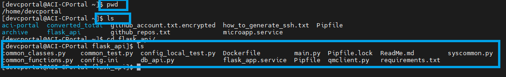
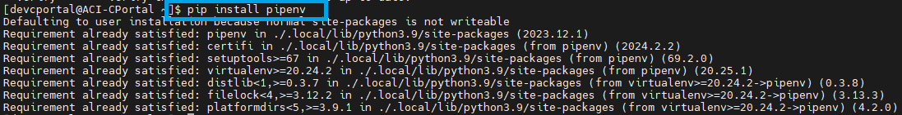
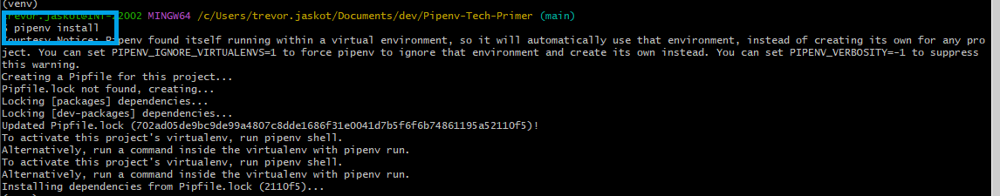
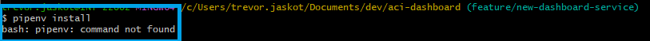
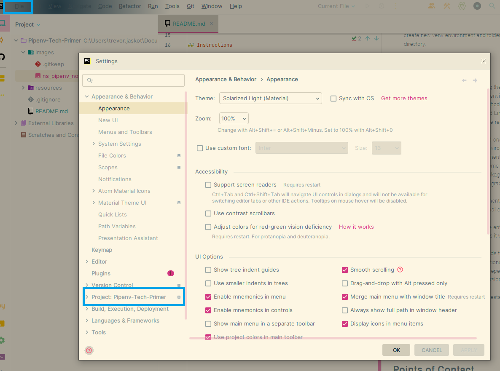
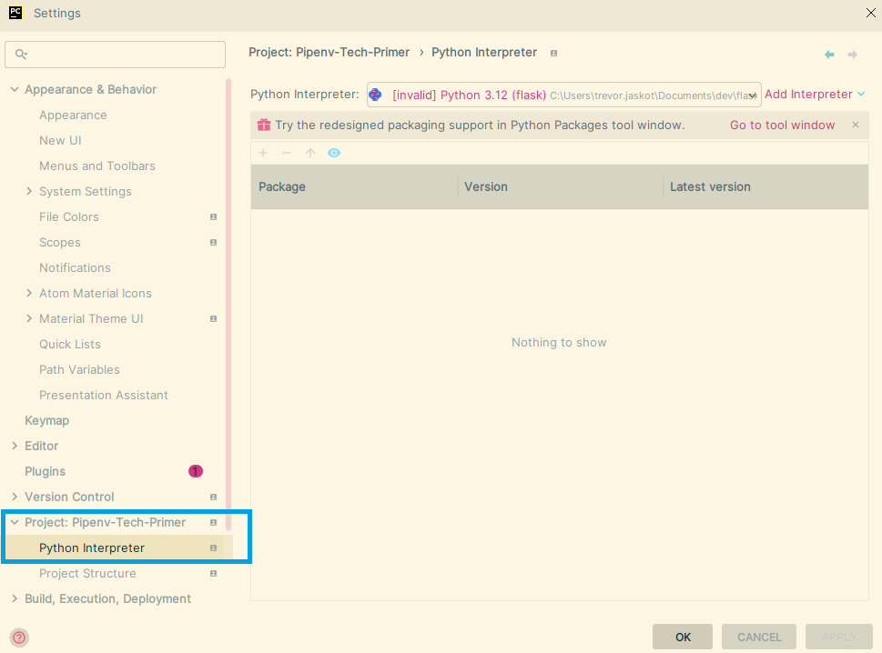
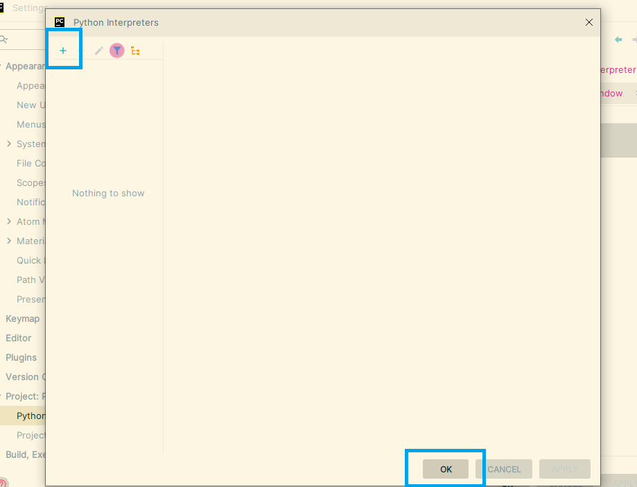
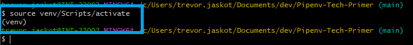
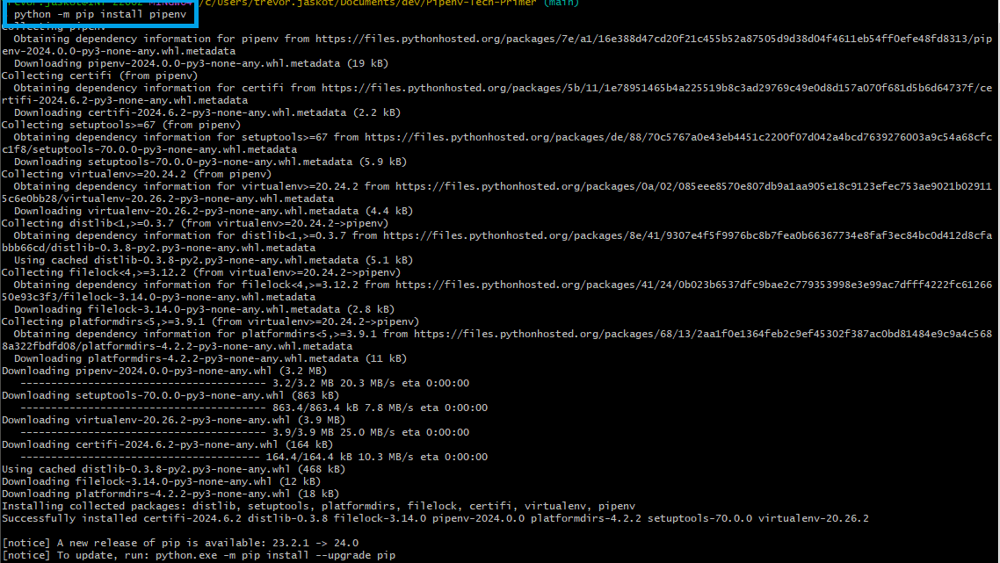
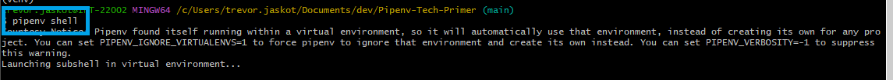

# Pipenv Tech Primer

Description/Purpose:
- Two methods on how to create and leverage Pipenv virtual environments and benefits therein.

## Prerequisites
- Git
- Terminal
- IDE (PyCharm Preferred)
- Python3

## Assumptions
- What a virtual environment is and how to create one using the Python3 venv module, or 
using Pycharm to create new venv environment and folder in your preferred directory.
- [Python Pipenv and virtual Environments](https://docs.python-guide.org/dev/virtualenvs/)

## Instructions

- If you are unsuccessful in leveraging the standard method of creating a Pipenv virtual
environment, then refer to the Alternative Creation Method below.
- For reasons that Mac, Windows, and Linux do not interact well with one another, there might
be reasons why standard method won't work.

- If you are asking yourself why would one prefer a Pipenv virtual environment over a virtual environment 
created by the user and leveraging the requirements.txt file with python -m venv module, here are some 
benefits:
  - Pipenv graph : manages all packages, package dependencies, and package upgrades on user's behalf.
  - Pipenv shell : a virtual environment subshell that automatically activated the virtual environment on user's behalf.
  - Pipenv virtual environments are entirely ephemeral and can be recreated exactly as it was before
with Pipfile.lock file.
  - Pipenv has conventional methods to work more dependably with container solutions as your solution and upgrades
are reliable and repeatable.
  - Pipenv manages the python version for you and version upgrades.
  - Pipenv is able to leverage unit tests with other python modules directly from code.
  - All commands in Pipenv and venv virtual environments can be executed without admin or root privileges.

### Standard Creation Method

- This method and practices can be found online and many resources exist to better understand how Pipenv works.
[Real Python Pipenv](https://realpython.com/pipenv-guide/)

- Navigate to directory of your choosing as any user, preferably non-admin privileges.


- Install pipenv. In this case pipenv is already installed, but your output will be very similar.


- Create new Pipenv virtual environment with pipenv install. This will grab the Pipfile
and use the packages and dependencies within to create, manage, and handle modules and packages
on your behalf.


- Execute pipenv shell command to activate the virtual environment and you are good to go! Test with
application command such as flask run.
```shell
# This is all accomplished without admin nor impact to global packages and environment.

# Command creates local shell within pipenv folder under /home/user/.local/<pipenv-venv>, or similar location.
pipenv shell
# Executes example application run.
flask --app main run --debug
```

### Alternative Creation Method

- In a terminal see if Pipenv is installed via command line.


- Open Pycharm and navigate to Settings.


- Open the Python Interpreter settings section.


- Create a new Virtual Environment, and then click Ok and then Apply.


- Source the activate file under newly created venv folder. It might be located under bin.
You can verify with listing directory tree
```shell
# List directory tree
ls *
# Source the activate file
source ./venv/Scripts/activate
```

- Afterwards you will see the kernel title change and include the characters "(venv)"


- Install pipenv within this virtual environment, and you will generate a Pipfile and Pipfile.lock.


- Activate Pipenv shell by installing dependencies and pipenv is smart enough to leverage the current virtual 
environment requirements when it creates the ephemeral version under .local folder.

  - Further information can be found: [Pipenv Location](https://stackoverflow.com/questions/53793833/get-path-of-virtual-environment-in-pipenv) 

- Run pipenv shell and you're good to go!


- From this point forward you are able to leverage pipenv in this project and all benefits that come 
along with this amazing tool!

## Points of Contact

- Author: Trevor Jaskot
  - Org: ACI IT
